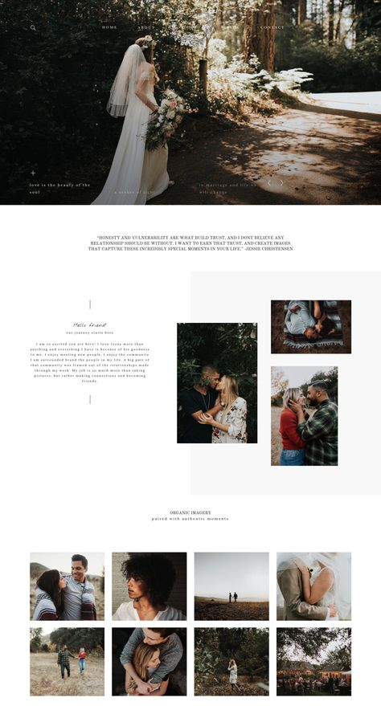
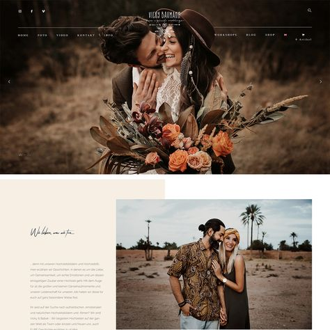
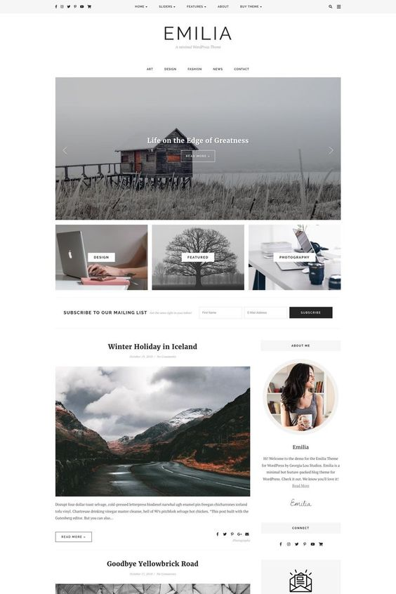
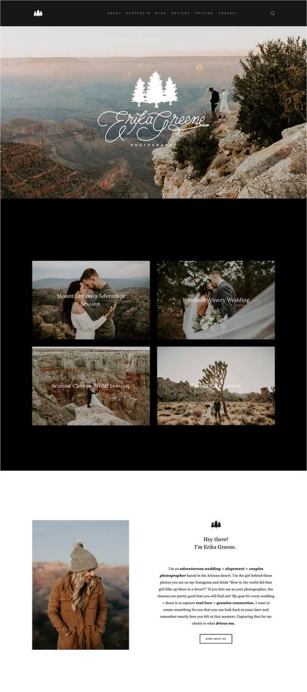
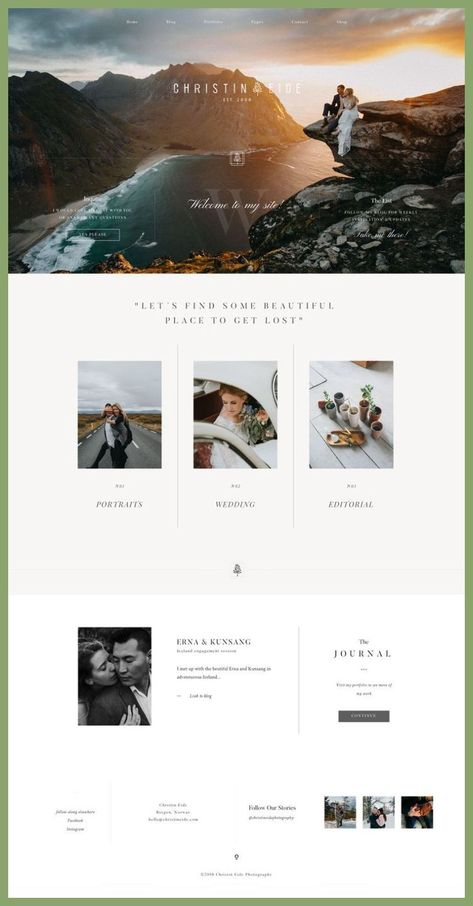
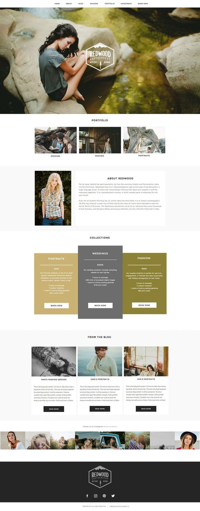

#### Full Stack Frameworks with Django Milestone Project
# Photography Website

*External user’s goal:*
*Users are able to purchase photographs to address their needs*
*Site owner's goal:*
*Earn money for doing and selling freelance photography*

##Loader Media

My fourth and final milestone project is a photography ecommerce site entitled Paper to Screen. One of the Full Stack Framework with Django Milestone Project ideas was to:

###Build a site to sell your graphic design services

####External user’s goal:
Users are able to purchase graphical designs to address their needs
Site owner's goal:
Earn money for doing freelance design work
Potential features to include:
Showcase prior work for clients, based on different kinds of requests, and the customer's testimonials.
Allow users to order a particular graphic to suit their goals. The user would fill out a form describing their needs, including fields such as type (e.g. icon, logo, poster), size and description, get an automatic quote and then pay. You may want to include a javascript calculator to display a preview of the quote, but make sure that the final price is determined on the server, and cannot be manipulated directly by the user.
The site owner, logging in as a special user, would be able to see a list of all orders, and then upload their completed work which would be made available to the customer.

The website includes a gallery which links to a checkout if a picture is selected to purchase. There is also a cart which allows a user to double check what they want to buy. The Website follows the CRUD (Create Read Update Delete) to allow the admin user (the photographer) to add new products and reviews to the site, edit them and delete them. Within the “My Favourites” page each listing features an affiliate link to Amazon. Note this is not an actual affiliate link, but rather just a way to demonstrate how this could work. Instead, for this project, we encourage you to just keep the tag value as something fake.
####The business goals of this website are:
* Build awareness of the photographer.
* Sell his products.
* Make it easy for a user to contact him.
* Provide a way of subscribing.
* Provide contact info to ensure all users are kept up to date. 
* Excellent UX to convince users to subscribe or stay on site long enough to obtain all information they would need.
* When a user subscribes they would have access to extra pages such as a blog and a ‘favourites’ page.
####The customer goals of this website are:
* Searching a photographer to hire or affordable photos to purchase.
* Some users may be interested in a collab or learning how to create better photographs. – They would do this via subscribing, they would then have access to tips, a blog, a list of favourite equipment, lighting and locations.
* Find contact information and social sites. 
* Clear and easy to find info on the site’s owner. His top choices and what the website is about.
###UX
This website is aimed at existing fans and possible new ones. It advertises new and existing photography, information on the site’s owner with his top recommendations and a clear way to contact him. (B2B) As a developer I wanted to create a colour scheme and picture aesthetic across all 4 pages to allow the website to flow, there would be no drastic changes and I ultimately wanted the user experience to be almost calming so it subconsciously gives Loader Media an aura of relaxation. (B2B & B2C) I also wanted the navigation system to be fairly simple so the user knows where the menu is sending them. Nothing ambiguous. I looked at many photography websites and forums of what fans wanted. (B2C)

 	
I started off by using Balsamiq to create my wireframes but then moved onto Publisher to create the other pages. This is mainly because I find the layout on Balsamiq easier to use however the colour and font elements on publisher opens more creative avenues.

###Features
####Header
The Header is featured  on every page. It is a black navbar that stretches across the width of the screen. The main title ‘Loader Media’ is featured in the middle with menu links both sides. The links to the left always display, the links to the right only display once a user has subscribed (registered).
####Footer
The footer is also featured on every page. At the very bottom is the footer this features the name of the developer and to the right, social links which provide a different way for users to contact the photographer and stay in the loop. The footer is Sage Green
####Section
#####Home
Directly underneath there is a hero image of one of the photographer’s photo’s, it features a tag which introduces the photographer and a “hire me” button which links to the contact page. Below is a picture of the photographer and some information on the type of photography he sells. As a user scrolls further down they will come to picture links which link them to the other pages. Just above the footer there is a selling point to try and convince the user to subscribe. The body is white.

#####About
The about page features a picture on the left with information about the photographer, it is a fairly simple and static HTML page. The only other element on this page is the 3 picture links below. Again the body is white, the picture have a sage green <container>.

#####Gallery
This page features the photographers pictures that are for sale. A user can add them to their cart, they can select a quantity and purchase even if they are not a registered user.

#####Contact
The first element on the contact page is an email form powered by JavaScript. Underneath is a static calendar that can only be amended through coding. This is purely to indicate to a user when the photographer is free. To the right of the page is a picture in a container, underneath that there is another subscription button.

#####Favourites (if logged in)
The Favourites page features the most JavaScript. Firstly there are 3 read more buttons, within the containers there is a “buy” button, these act as affiliate links. Below this to the left is a picture and next to this on the right is 3 accordion’s listing the photographer’s favourite location to take pictures.

####Existing Features
* Header Navigation Bar - Exists on every page and allows all users to easily navigate all the website's pages and find what they are looking for quickly. 
* Header Title – Exists on every page acts almost like a logo but doesn’t link to the homepage. 
* Header Social Icons – Exists on every page and allows all users to access the social platforms that the artist uses. 
* Footer Social Icons - Exists on every page and allows all users to access the social platforms that the artist uses
* Products/ Gallery 
    * Users are able to purchase photograph to address their needs
    * Stripe (checkout)
    * Allow users to order a particular picture to suit their goals. The user would be able to select the image they would like and then fill out a form describing their needs, including fields such as type (e.g. canvas, print, framed), if framed- select colour of frame, size(e.g. A5, A4, A3) and any other bespoke changes, get an automatic quote and then pay.
        * Include a JS calculator to display a preview of the quote, but make sure that the final price is determined on the server, and cannot be manipulated directly by the user.
* Subscription 
    * access to Blog
    * First order 20% off
    * 10% off annual discount
    * Forum
    * a user would have to register to persist their shopping cart between sessions (otherwise it would be lost)
#####HTML & CSS
* Home
* About Photographer
    * Google Maps API
    * List of favourite equipment
        * Affiliate links
* Tips and Tricks 
    * Brief, to Read More subscribe
* Gallery
    * Build a custom js display mechanism for the gallery page - e.g. your own unique kind of carousel.
* Booking Form
    * Calendar of availability
* Contact Form
    * Contact for collab
    * Email functionality
        * Email JS
* Option to subscribe
    * List Benefits of subscription
    * Can also subscribe to Newsletter
* Black, White and Sage
* Bootstrap
* Menu – Drop Down

####Features to Implement in future
* FAQ page, table with FAQs and dropdown buttons to view answers - Gives potential clients easy to find answers to their common questions. 
* Blog - Allows new and existing fans to discover the website through articles written by the members about topics such as their books/films/series what they have been up to and what they would like to accomplish. 
* Option to choose the language of the website - As the site expands it wouldn’t place a limit on their following. 
* Promotional Video - Allows potential clients to connect with the site. 

###Technology Used
* This project uses HTML and CSS programming languages. 
* GitPod - IDE
* GitHub – Save Code
* Heroku - Hosting
* BootstrapCDN
* FontAwesome 
* Google Fonts  
* W3Schools
* Javascript
* Python
* PHP
* Flask
* Django
* Stripe – Payment Options
* S3

###Testing
* W3C CSS validation 
* W3C Markup Validation 
    * The developer used W3C CSS Validation Service and W3C Markup Validation Service to check the validity of the website code.

####Testing client stories from UX section of README.md
1.	As a new visitor to the website, I want to easily navigate the site, so I can find what I need efficiently. 
    1. No matter what page the new visitor lands on, they can easily find and use the navigation bar.
2.	As a new visitor to the website, I want to know what books are recommended, so I can decide if I want to follow their work.
3.	As a visitor to the website, I am curious to know more about the sites owners, so I can connect with them on a personal level. 
    1. A clearly labelled About page is easy to find on the navigation on every page. 
    2. The page contains photos of the sites owners and short but compelling text with info on each girl.
4.	As a user, I want to know what people think of the books and the screen adaptation. 
    1. On the home page, top choices from the sites owners are easy to find and to read.
5.	As a user, I want to view suggestions for books/films/series, so I can decide if it is within my budget to order. 
    1. Once the visitor to the website has already been led by call to action buttons from the Home page, and through to the Our Choices, they are then led to amazon through an affiliate link.
6.	As an interested client, I want an easy way to be able to contact the sites owner, if I have a more personal request or a business enquiry. 
7.	As an interested observer and/or potential client, I want to follow the sites owners on social media, so I can keep up with her latest news.
    1. social media icons can be found in the header and footer on every page of the website.
####Manual testing.
#####Header:
1.	Go to the "Home" page from a desktop.
2.	Change the screen size from desktop to mobile to verify that the navigation bar looks good on smaller screen sizes also.
3.	When checking responsiveness of navbar, verify that there is no overflow causing ugly size changes to menu items.
4.	Hover over the menu bar to test the hover elements.
5.	Hover over social links to see the colour change.
6.	Click on each navigation menu item and verify that it links to the correct page.
7.	Change screen size to small and verify that menu text is centred.
8.	Repeat verification of functionality and responsiveness on div tools.
#####Footer:
1.	Hover over each social media icon and confirm colour and size transitions expected.
2.	Reduce and expand width of window to verify that the footer is responsive and looks good on all device widths.
3.	Review all functionality and responsiveness on div tools.
#####Page images:
1.	Hover over each image in the content and confirm that the alt title for each appears.
2.	Reduce and expand width of window to verify that each image behaves and centres the way expected, and that they look good on all device widths.
#####Page content:
1.	Reduce and expand width of window to verify that each line of text behaves the way expected, and that the text arrangement looks good on all device widths.
2.	Read More/Read Less – ensure each column is centred. 
3.	Contact form: Go to the "Contact Us" page
    1. Try to submit the empty form and verify that an error message about the required fields appears
    2. Try to submit the form with an invalid email address and verify that a relevant error message appears
    3. Try to submit the form with all inputs valid and verify that a success message appears.
4.	Click “Edit” “Read” “Watched” and “Add a Book” to make sure they link to the correct pages.
5.	Run app.py

###Deployment
####GitHub
This project was developed using the GitPod IDE, committed to git and pushed to GitHub. To deploy this page to GitHub Pages from its GitHub repository, the following steps were taken:
1.	Log into GitHub.
2.	From the list of repositories on the screen, select elizabeth24602/the-swallows.
3.	From the menu items near the top of the page, select Settings.
4.	Scroll down to the GitHub Pages section.
5.	Under Source click the drop-down menu labelled None and select Master Branch
6.	On selecting Master Branch the page is automatically refreshed, the website is now deployed.
7.	Scroll back down to the GitHub Pages section to retrieve the link to the deployed website.

####Heroku
To deploy your app to Heroku, you typically use the git push command to push the code from your local repository’s master branch to your heroku remote, like so:
git push heroku master
Initializing repository, done.
updating 'refs/heads/master'
...
Use this same command whenever you want to deploy the latest committed version of your code to Heroku.
Note that Heroku only deploys code that you push to the master branch of the heroku remote. Pushing code to another branch of the remote has no effect.

###Credits
####Content
* The text for the website was created for Paper to Screen by Elizabeth Perrey. 
* The text was proof-read/edited by Elizabeth Perrey
####Media
* All the photos used in this site were obtained from pinterest.
####Code
* CSS
* HTML
* JavaScript
* Python
####Acknowledgements
* I received inspiration for this project from my own experience of building and maintaining a WordPress Blog for personal use in the past years.

